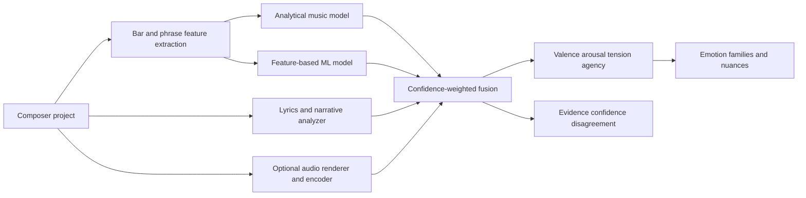

# Emotion Analysis System — Brainstorm

## Purpose

Composer could analyze the emotional character of a song from the evidence it already represents: narrative intent, lyrics, sections, chords, MIDI notes, tempo, dynamics, instrumentation, and arrangement.

The system should not present emotion as an objective property. It should produce an explainable interpretation with confidence, show which musical or lyrical evidence supports it, and let the songwriter accept, reject, or edit the result.

Three related targets should remain distinct:

1. **Intended emotion** — what the songwriter wants the section to communicate.
2. **Perceived emotion** — what the musical artifact appears to express.
3. **Induced emotion** — what a particular listener actually feels.

Composer knows the most about intended emotion and can estimate perceived emotion. Induced emotion requires listener-specific data. A difference between intent and perception can be useful compositional feedback rather than a model failure.

## Recommendation

Build a hybrid system rather than choosing only analytical rules, machine learning, deep learning, or an LLM.

Use each technique where it is strongest:

- Deterministic musical analysis for local, explainable evidence.
- An LLM for lyrical meaning, narrative transformation, ambiguity, and explanations.
- A small trained model later to learn interactions between extracted features.
- Pretrained symbolic or audio encoders only after the product has a useful labeled dataset and a clear need for them.

## Shared representation

Predict continuous dimensions before mapping into emotion names:

- **Valence:** unpleasant to pleasant
- **Arousal:** calm to energetic
- **Tension:** stable to unresolved
- **Agency:** powerless to empowered

Possible later dimensions:

- Certainty
- Intimacy or social distance
- Novelty or familiarity
- Dominance
- Emotional magnitude

Map the continuous representation into Composer's emotion families and nuances. This preserves ambiguity: a passage may be high in yearning and hope simultaneously rather than being forced into one label.

## Approach 1: Analytical engine

This should be the foundation and first implementation.

### Harmonic evidence

- Key and mode
- Chord quality and extensions
- Tonal stability of each chord
- Harmonic rhythm
- Dissonance and chromaticism
- Cadence strength
- Suspensions and delayed resolution
- Modulation and borrowed chords
- Melody/chord agreement and non-chord tones

Examples of cautious heuristics:

- Sustained tonal instability tends to raise tension.
- Strong dominant-to-tonic resolution tends to reduce tension.
- Minor harmony may lower valence, but only in combination with other evidence.
- Faster harmonic rhythm may raise arousal or instability.

### Melodic evidence

- Register and register changes
- Rising, falling, arch, and static contour
- Interval size and direction
- Repetition and motif persistence
- Pitch-class stability against the current chord
- Chromaticism
- Note density and phrase range
- Climactic notes

### Rhythmic evidence

- Tempo
- Onset density
- Syncopation
- Rhythmic regularity
- Rest density
- Beat strength of note attacks
- Acceleration or deceleration of activity

### Performance and dynamics

- MIDI velocity
- Articulation and note duration
- Dynamic range
- Crescendo and decay
- Accent patterns

### Arrangement evidence

- Number of active tracks
- Instrument entrances and exits
- Register width
- Bass and percussion activity
- Texture density
- Unison versus independent motion
- Instrument-family associations, treated as weak evidence
- Contrast with the preceding section

### Structural evidence

- Section role
- Repetition and variation
- Buildup and release
- Position in the song
- Relationship to earlier occurrences of the same section
- Whether the passage functions as setup, climax, rupture, or resolution

### Advantages

- Runs locally
- No training set required
- Fast and deterministic
- Produces direct explanations
- Easy to unit test

### Risks

- Musical-emotion rules are culturally and genre dependent.
- Individual features are weak signals. A minor chord is not automatically sad.
- Rules can become brittle if they are treated as conclusions instead of evidence.

The engine should therefore emit evidence contributions and uncertainty, not absolute labels.

## Approach 2: Machine learning over engineered features

Once enough sections have human labels, train a small model using the analytical feature vector.

Candidate models:

- Logistic or ordinal regression
- Gradient-boosted trees
- Random forest
- Small multilayer network
- Temporal model over adjacent sections

This model can learn interactions that handcrafted rules miss. For example, minor harmony combined with slow tempo, falling melodic contour, low velocity, sparse texture, and loss-oriented lyrics is much stronger evidence than minor harmony alone.

### Advantages

- Requires less data than end-to-end deep learning
- Can run locally
- Easier to calibrate
- Feature contributions can remain inspectable
- Straightforward ablation testing

### Requirements

- A stable feature schema
- Human-labeled sections or phrases
- Multiple annotators where possible
- Separation of songs across train and test sets
- Genre-aware evaluation
- Storage of annotator disagreement rather than only majority labels

## Approach 3: Deep learning

### Symbolic MIDI models

Represent MIDI as event tokens or piano-roll sequences and predict emotion per window or section. A pretrained symbolic encoder is preferable to training a transformer from scratch.

The EMOPIA dataset provides 1,087 audio/MIDI pop-piano clips from 387 songs with perceived-emotion annotations from four annotators. It is relevant but limited: piano-pop emotion will not transfer perfectly to complete rock, electronic, orchestral, or rhythm-led arrangements.

Reference: [EMOPIA paper](https://arxiv.org/abs/2108.01374)

### Audio models

Render the project or analyze imported audio, then use a pretrained music-audio encoder and a small downstream prediction head. This captures timbre, production, articulation, and effects that symbolic MIDI cannot.

MERT is an example of a music-specific self-supervised acoustic representation model designed to generalize across music-understanding tasks.

Reference: [MERT paper](https://arxiv.org/abs/2306.00107)

DEAM contains 1,802 excerpts and full songs with continuous per-second and whole-song valence/arousal annotations. It is useful for audio-based modeling and evaluation, though it does not directly solve symbolic MIDI or lyric analysis.

Reference: [DEAM dataset](https://cvml.unige.ch/databases/DEAM/)

### Advantages

- Learns complex interactions directly from sequences or audio
- Can capture patterns that are difficult to express as rules
- Pretrained encoders reduce the required task-specific data

### Risks

- Dataset mismatch by genre, culture, instrumentation, and production style
- Harder explanations and debugging
- Larger runtime and model distribution cost
- Audio inference introduces a rendering dependency
- End-to-end models may learn spurious correlations

## Approach 4: LLM analysis

An LLM is most useful for semantic interpretation:

- Lyric sentiment and emotional nuance
- Narrative change
- Metaphor and imagery
- Agency, certainty, social orientation, and temporal perspective
- Distinguishing nostalgia from sadness
- Recognizing hope, resignation, devotion, alienation, irony, and ambiguity
- Writing evidence-backed explanations

Do not ask the LLM to infer the whole musical emotion from raw note names. Give it structured evidence produced by the analytical engine.

Example input:

```json
{
  "section": "Final chorus",
  "lyrics": "...",
  "harmony": ["C", "G", "F", "G"],
  "melody": {
    "contour": "rising",
    "registerChangeSemitones": 5,
    "repetition": 0.72
  },
  "arrangement": {
    "activeTracks": 10,
    "velocityChange": 18,
    "registerWidthChange": 11
  },
  "previousSection": {
    "tension": 0.71,
    "arousal": 0.54
  }
}
```

Require structured output:

```json
{
  "dimensions": {
    "valence": 0.68,
    "arousal": 0.74,
    "tension": 0.43,
    "agency": 0.81
  },
  "emotions": {
    "hope": 0.82,
    "yearning": 0.61,
    "nostalgia": 0.25
  },
  "evidence": [
    "future-oriented lyric language",
    "rising melodic contour",
    "increased arrangement density",
    "repeated dominant-to-tonic resolution"
  ],
  "confidence": 0.71,
  "ambiguities": [
    "The major resolution raises valence, while the lyric retains longing."
  ]
}
```

### Risks

- Scores are prompt-sensitive and not inherently calibrated.
- Explanations may sound more certain than the evidence supports.
- Hosted inference conflicts with a completely local-first workflow.
- Sending copyrighted lyrics or private drafts requires explicit privacy decisions.

Use the LLM as a semantic analyst and explanation layer, not as the only detector.

## Hybrid architecture



Fusion weights should depend on available evidence:

- No lyrics: rely more on symbolic and audio evidence.
- Sparse MIDI: rely more on lyrics, narrative, and declared intent.
- Full audio: include timbre and production evidence.
- Strong disagreement between modalities: lower confidence instead of forcing consensus.
- Repeated section with changed arrangement: preserve lyrical interpretation while updating arousal and magnitude.

## Suggested output model

```ts
interface EmotionAnalysis {
  targetId: string
  targetType: 'song' | 'section' | 'phrase' | 'bar'
  dimensions: {
    valence: Estimate
    arousal: Estimate
    tension: Estimate
    agency: Estimate
  }
  emotions: Array<{
    emotionId: string
    score: number
    confidence: number
  }>
  evidence: EmotionEvidence[]
  modalityScores: {
    narrative?: EmotionVector
    lyrics?: EmotionVector
    harmony?: EmotionVector
    melody?: EmotionVector
    rhythm?: EmotionVector
    arrangement?: EmotionVector
    audio?: EmotionVector
  }
  disagreement: number
  modelVersion: string
}

interface Estimate {
  value: number
  confidence: number
}

interface EmotionEvidence {
  source: 'narrative' | 'lyrics' | 'harmony' | 'melody' | 'rhythm' | 'dynamics' | 'arrangement' | 'structure' | 'audio'
  feature: string
  observation: string
  contribution: number
  affectedDimensions: string[]
}
```

Keep analysis separate from the songwriter's accepted emotion plan. Suggested results should never silently replace authored intent.

## Product experience

Possible UI behavior:

- **Analyze section** produces suggestions without changing the project.
- Show the inferred emotional curve beside the intended curve.
- Explain the strongest supporting and conflicting evidence.
- Let the user accept the complete curve, individual points, or emotion labels.
- Allow feedback: accurate, inaccurate, too strong, too weak, wrong nuance.
- Show uncertainty and disagreement explicitly.
- Compare repeated sections to explain why the final chorus feels different despite shared lyrics or harmony.

Example:

> Perceived hope rises from 62% to 81% in the final chorus. The melodic register rises, five additional tracks enter, velocity increases, and dominant harmony resolves repeatedly. The lyrics still carry yearning, so confidence is moderate rather than high.

## Evaluation

### Annotation design

- Analyze short windows, phrases, sections, and whole songs separately.
- Collect both continuous dimensions and named emotions.
- Ask whether labels describe perceived or induced emotion.
- Use multiple annotators.
- Retain per-annotator responses and disagreement.
- Include genre, culture, musical training, and familiarity metadata where ethical and useful.

### Metrics

- Correlation and concordance for continuous valence/arousal curves
- Mean absolute error for dimensions
- Macro F1 or average precision for emotion labels
- Calibration error for confidence
- Agreement with users' accepted revisions
- Explanation faithfulness through feature ablation
- Temporal smoothness without erasing genuine transitions

### Essential tests

- Transpose a passage: emotion should remain mostly stable.
- Raise velocity while preserving notes: arousal should rise more than valence.
- Remove drums: arrangement-driven arousal should fall.
- Change major to minor while preserving rhythm: harmonic evidence should change predictably.
- Keep lyrics but change arrangement: semantic emotion should remain while musical magnitude changes.
- Contradict hopeful lyrics with tense harmony: the model should report disagreement.

## Development roadmap

### Phase 1: Explainable analytical prototype

1. Define the four-dimensional internal representation.
2. Extract bar-level harmony, melody, rhythm, dynamics, and arrangement features.
3. Normalize features relative to the song as well as globally.
4. Build cautious evidence-to-dimension rules.
5. Aggregate bars into phrases and sections.
6. Map dimensions into Composer emotions.
7. Display evidence, confidence, and intended-versus-perceived curves.

### Phase 2: Semantic analysis

1. Add deterministic lyric features such as sentiment, tense, pronouns, and agency.
2. Add an optional LLM analyzer with schema-constrained output.
3. Keep prompts and model versions traceable.
4. Add privacy controls and local-only fallback behavior.

### Phase 3: Feedback and dataset creation

1. Record user corrections only with explicit consent.
2. Store the input feature vector and model version with feedback.
3. Distinguish a creative override from a judgment that the analysis is wrong.
4. Build an internal evaluation set across genres and arrangements.

### Phase 4: Feature-based learned model

1. Train a small calibrated model on accepted labels.
2. Compare it with the analytical baseline.
3. Run feature and modality ablations.
4. Preserve the analytical engine as an explanation and fallback path.

### Phase 5: Pretrained representation models

1. Evaluate symbolic MIDI embeddings.
2. Evaluate rendered-audio embeddings.
3. Add only modalities that materially outperform the simpler system.
4. Use confidence-aware fusion instead of replacing earlier layers.

## Open questions

- Should the first release predict only dimensions or also named nuances?
- Should analysis run continuously or only when requested?
- How should user-authored emotion intent influence perceived-emotion estimates?
- Is hosted lyric analysis acceptable for a local-first product?
- Should lyrics remain client-side with a local model option?
- How should the system handle culturally specific musical conventions?
- Should repeated choruses share semantic analysis while retaining separate arrangement analysis?
- How much evidence is enough to show a named emotion?
- Should confidence describe model certainty, annotator agreement, or both?
- How should instrumental descriptions in lyric fields affect analysis?

## Initial recommendation

Start with an explainable analytical engine plus optional LLM lyric interpretation. Do not begin by training a deep model.

This path creates immediate product value, establishes the feature schema and explanation language, and turns user corrections into the dataset needed to decide whether classical ML, symbolic deep learning, audio embeddings, or all three are justified later.
